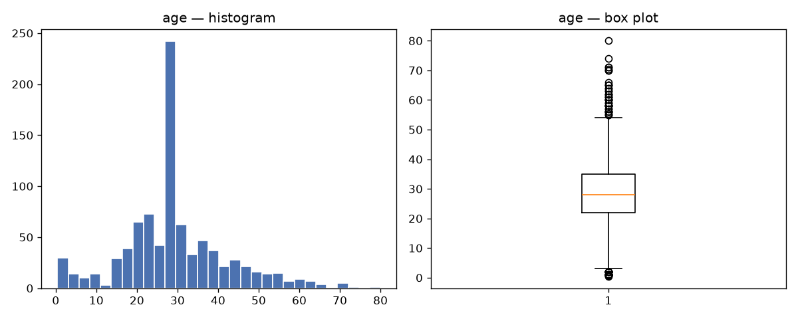
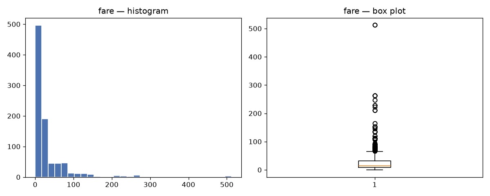
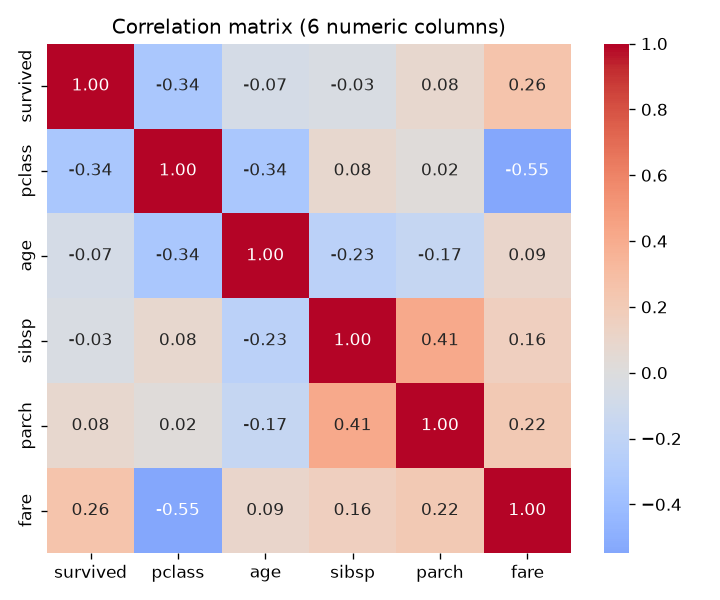
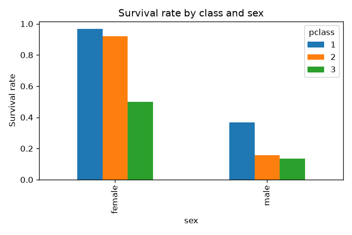
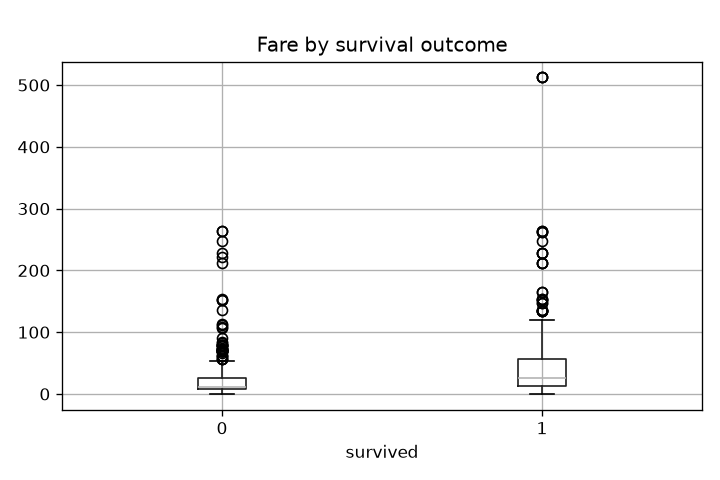
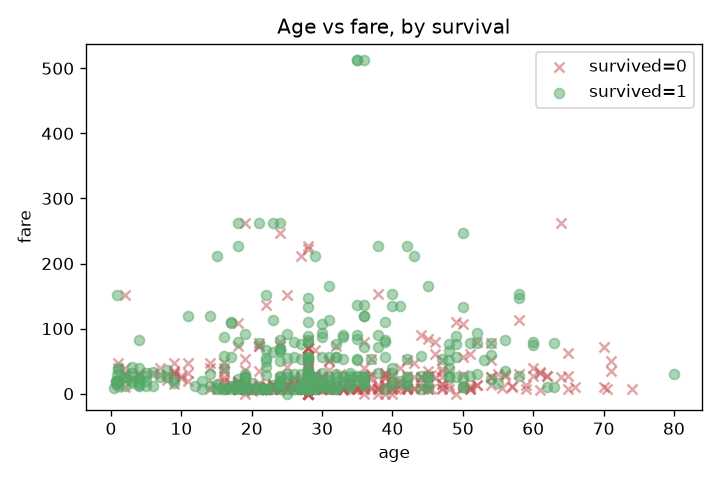
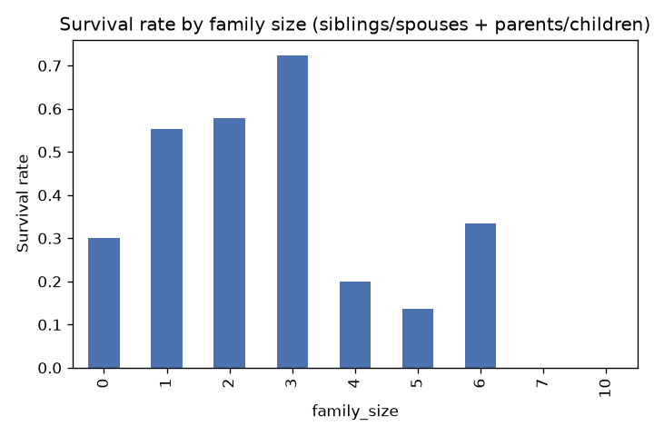

# EDA Findings — /analytics

## Task 1 — Profile

Shape: `(891, 15)`. Columns with any missing values:

|             |   missing_% |
|:------------|------------:|
| deck        |   77.2166   |
| age         |   19.8653   |
| embarked    |    0.224467 |
| embark_town |    0.224467 |

## Task 2 — Missing-value handling

(Cleaning logic lives in `src/cleaning.py` — `02_modeling.py` calls the same function on the same raw `titanic.csv`, so both stages apply identical cleaning without re-deciding the policy or needing a second CSV.)

- `deck`: **77.22%** missing — far above the reliable-impute range. **Decision: drop the column.** At this missing rate, imputation would fabricate the large majority of the column's values, and the partial signal it carries (cabin location as a wealth/class proxy) is already captured, with far less missingness, by `pclass` and `fare`.

- `embarked` / `embark_town`: **0.22%** missing (< 5%) — **decision: drop those rows** (2 rows removed). At this rate, dropping costs negligible data and avoids inventing a port of embarkation for the 2 affected passengers.

- `age`: **19.87%** missing (5-30% range) — **decision: impute** with the column median (28.0 years). Median chosen over mean because age is right-skewed by older outliers, and median is robust to that skew.

Shape after cleaning: `(889, 14)`

## Task 3 — Univariate analysis (age, fare)

- `age` IQR outliers: **65** (outside [2.5, 54.5])
- `fare` IQR outliers: **114** (outside [-26.8, 65.7])

- `fare`: mean = **32.10**, median = **14.45**, mode = **8.05**. Since mean > median > mode, `fare` is **right-skewed** — a small number of very expensive tickets pull the mean well above the typical (median) fare.

## Task 4 — Bivariate analysis

- Survival rate by sex: female = **0.740**, male = **0.189**

Survival rate by pclass:

|   pclass |   survival_rate |
|---------:|----------------:|
|        1 |        0.626168 |
|        2 |        0.472826 |
|        3 |        0.242363 |

Survival rate by sex + pclass:

|               |   survival_rate |
|:--------------|----------------:|
| ('female', 1) |        0.967391 |
| ('female', 2) |        0.921053 |
| ('female', 3) |        0.5      |
| ('male', 1)   |        0.368852 |
| ('male', 2)   |        0.157407 |
| ('male', 3)   |        0.135447 |

(Boolean-masking spot check: female + 1st class survival rate = **0.967**, matching the groupby table above.)

**Two strongest correlations (by absolute value):**

- `pclass` vs `fare`: **-0.548**
- `sibsp` vs `parch`: **0.415**

## Task 5 — Multivariate data story

Class and sex compound rather than substitute for each other: 1st-class women survived at the highest rate of any group, while 3rd-class men survived at the lowest — sex alone or class alone understates how much they interact.

Survivors paid a visibly higher median fare than non-survivors, and the survivor group has a longer upper tail — consistent with fare acting as a proxy for cabin location and deck access, which affected evacuation odds.

Survivors (green) are not concentrated at young ages the way a pure 'children first' story would predict; they're spread across ages but skew toward the higher end of the fare range — reinforcing that fare/class mattered at least as much as age.

Survival peaks at a small-to-medium family size (1-3) rather than at 0: travelling completely alone or in a very large family group are both associated with lower survival — plausibly reflecting that solo travellers had no one helping them find a lifeboat, while very large families struggled to stay together and evacuate as a unit.

## Task 6 — Standardization sanity check (EDA-stage only)

Before standardization:

|      |     age |    fare |
|:-----|--------:|--------:|
| mean | 29.3152 | 32.0967 |
| std  | 12.9849 | 49.6975 |

After z-score standardization (`age_z`, `fare_z`):

|      |   age_z |   fare_z |
|:-----|--------:|---------:|
| mean |       0 |        0 |
| std  |       1 |        1 |

Both transformed columns have mean ~0 and std ~1, confirming the z-score formula was applied correctly. This is an EDA-stage check only — the modeling pipeline in `02_modeling.py` fits its own `StandardScaler` on the training split alone (Task 8), it does not reuse these columns.
