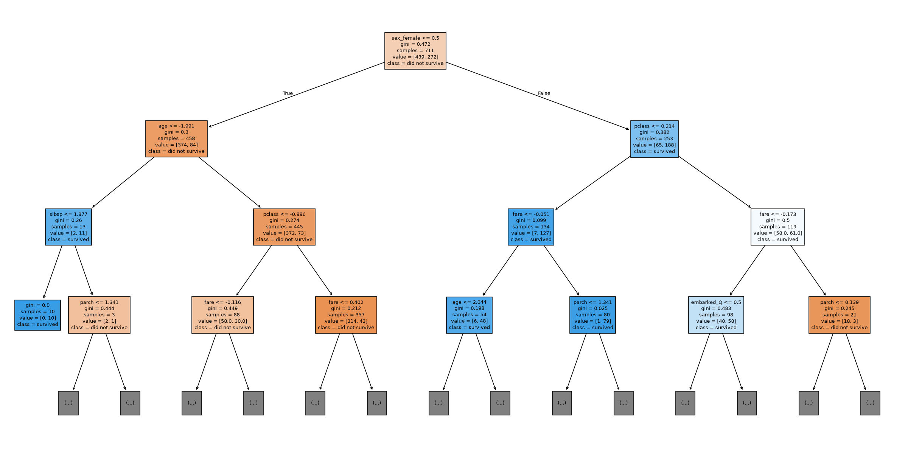
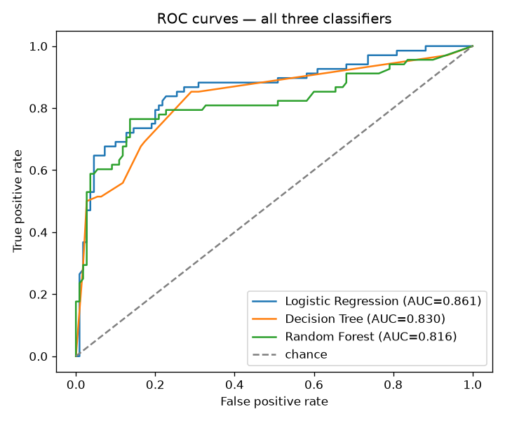
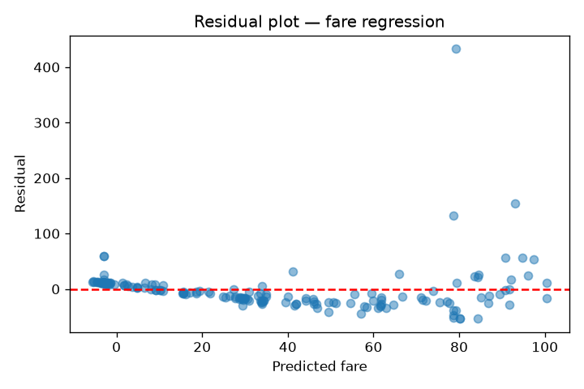

# Modeling Findings — /analytics

## Task 7 — Stratified split

Class balance (`survived`): {0: 0.618, 1: 0.382}

The classes are imbalanced (~38% survived vs ~62% not). A plain random split risks over- or under-representing the minority (survived) class in the test fold by chance, which would make evaluation metrics for that class noisy and unreliable. Stratifying on `survived` forces both train and test to keep the same ~38/62 ratio as the full dataset, so metrics are measured on a representative test set.

Train size: 711, test size: 178

## Task 8 — Preprocessing pipeline

`ColumnTransformer` applies a median `SimpleImputer` + `StandardScaler` to numeric columns and a most-frequent `SimpleImputer` + `OneHotEncoder` to `sex`/`embarked`, wrapped so every `.fit(...)` call below fits this preprocessor **only on `X_train`**; `X_test` only ever sees `.transform(...)`. This is enforced structurally by always fitting the full sklearn `Pipeline` (preprocessor + estimator) on `(X_train, y_train)` and only ever calling `.predict`/`.transform` on `X_test` — never `.fit` or `.fit_transform`.

## Task 9 — Three classifiers trained

Logistic Regression, Decision Tree (`max_depth=5`), Random Forest (`n_estimators=200`) — all trained on the identical `(X_train, y_train)`.

 (first 3 levels shown for readability)

## Task 10 — Evaluation (side-by-side)

| model               |   accuracy |   precision |   recall |    f1 |   auc |
|:--------------------|-----------:|------------:|---------:|------:|------:|
| Logistic Regression |      0.809 |       0.783 |    0.691 | 0.734 | 0.861 |
| Decision Tree       |      0.758 |       0.745 |    0.559 | 0.639 | 0.83  |
| Random Forest       |      0.809 |       0.774 |    0.706 | 0.738 | 0.816 |

Confusion matrices (rows = actual [0,1], cols = predicted [0,1]):

- **Logistic Regression**: `[[97, 13], [21, 47]]`
- **Decision Tree**: `[[97, 13], [30, 38]]`
- **Random Forest**: `[[96, 14], [20, 48]]`

## Task 11 — Imbalance handling comparison (Random Forest)

Class balance: {0: 0.618, 1: 0.382}

| variant               |   precision |   recall |    f1 |
|:----------------------|------------:|---------:|------:|
| baseline              |       0.774 |    0.706 | 0.738 |
| class_weight=balanced |       0.754 |    0.765 | 0.759 |
| SMOTE                 |       0.773 |    0.75  | 0.761 |

**Conclusion:** `SMOTE` gives the best F1 on the test set. SMOTE resamples only `X_train_proc`/`y_train` (the already-preprocessor-transformed training fold) — the test fold is never touched by SMOTE, avoiding leakage. In practice `class_weight='balanced'` is often preferred operationally over SMOTE here since it needs no synthetic data generation and is cheaper to reproduce, but the table above reports both so the trade-off is visible rather than assumed.

## Task 12 — Hyperparameter tuning (Random Forest)

Best params: `{'max_depth': None, 'max_features': 'sqrt', 'n_estimators': 100}`

OOB score of the best estimator: **0.8087**

## Task 13 — Regression side-task (predict fare)

MAE = **21.14**, RMSE = **41.75**, R² = **0.347**, Adjusted R² = **0.324**

The residual plot **shows heteroscedasticity — residual spread visibly widens as predicted fare increases, so the constant-variance assumption of ordinary least squares is violated**.

## Task 14 — Final model comparison

**Classification models:**

| model               |   accuracy |   precision |   recall |    f1 |   auc |
|:--------------------|-----------:|------------:|---------:|------:|------:|
| Logistic Regression |      0.809 |       0.783 |    0.691 | 0.734 | 0.861 |
| Decision Tree       |      0.758 |       0.745 |    0.559 | 0.639 | 0.83  |
| Random Forest       |      0.809 |       0.774 |    0.706 | 0.738 | 0.816 |

**Regression model (fare prediction):**

| model             |   MAE |   RMSE |    R2 |   Adjusted_R2 |
|:------------------|------:|-------:|------:|--------------:|
| Linear Regression | 21.14 |  41.75 | 0.347 |         0.324 |

**Recommendation:** deploy **Random Forest**. It has the highest F1 (0.738) among the three classifiers, balancing precision (0.774) and recall (0.706) rather than optimizing one at the other's expense — important here since both false positives and false negatives on 'survived' are costly in different ways. Its AUC (0.816) also confirms it separates the two classes well across thresholds, not just at the default 0.5 cutoff. Classification and regression metrics above are reported as two separate tables/scales — they are not directly comparable to each other.

## Task 15 — Saved pipeline

Saved `Random Forest`'s full fitted pipeline (preprocessor + estimator together) to `model_pipeline.joblib` via `joblib.dump`. Reloaded it with `joblib.load` and confirmed it predicts identically on a raw (unpreprocessed) test row: original prediction = `0`, reloaded prediction = `0` — **match confirmed**.
